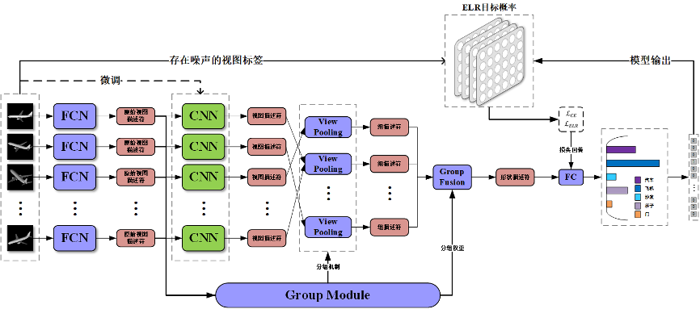

# 噪声标签下的三维模型分类方法

1. 数据处理
   1. 3DWebNet(views=12)

       3DWebNet40具有与ModelNet40相同的类别信息，并且规模更大，但存在label noise和backgr noise，初期阶段模型训练及评估使用通过循环置换标签添加噪声的ModelNet40
   2. ModelNet40(views=12)
       - ModelNet共包含40个语义信息，训练集、测试集样例数分别为118116和29616
       - 每组物体模型由12个不同角度的样例组成
       - **mvcnn_elr/tools/ImgDataset.py完成了数据集的处理，每组数据包含(class_id, image_tensor, filepath)**
       - **data/image目录中存储了transform转化后的image_tensor，运行时加载到内存中，以便一个样例只需要trans一次，提升训练效率**
       - stage1使用train_image.npz和test_image.npz，共需约8GB显存；stage2使用train_image和test_image_enhanced.npz，共需约12GB显存

2. Baseline
   
   - 实验采用MVCNN作为基于multi-view的三维模型分类方法的基准模型
      
       SU H, MAJI S, KALOGERAKIS E, et al. Multi-view Convolutional Neural Networks for 3D Shape Recognition[C/OL]//2015 IEEE International Conference on Computer Vision (ICCV), Santiago, Chile. 2015. http://dx.doi.org/10.1109/iccv.2015.114. DOI:10.1109/iccv.2015.114. 

       code: https://github.com/jongchyisu/mvcnn_pytorch
   - 实验采用ELR作为噪声标签学习的基本方法
  
       LIU S, NILES-WEED J, RAZAVIAN N, et al. Early-Learning Regularization Prevents Memorization of Noisy Labels[J]. Neural Information Processing Systems, 2020.

       code: https://github.com/shengliu66/ELR

3. 运行方法
   
   1. 环境设置
       - 下载实验所需依赖
          ```
          pip install -r requirement.txt
          ```
       - 配置实验输入输出环境

          创建目录存储ModelNet40数据集: http://supermoe.cs.umass.edu/shape_recog/shaded_images.tar.gz
   2. 参数设置
       - 修改train_path和val_path
          ```
          data/modelnet40_images_new_12x/*/train
          data/modelnet40_images_new_12x/*/test
          ```
       - 修改img_log_dir和img_log_name、save_dir

          设置训练日志保存路径，包括train.log和train.png
       - 设置image_load(save)_path_train(test)和image_load_path_test_multi
         
          **如果未保存train_image.npz等，则设置load路径为空""，并设置对应的save路径**
    
   3. train
       - **mvcnn_elr/train/train.py** 可直接运行
       - stage2依赖于stage1，但可直接使用stage1阶段训练好的model
          ```
          cnet = torch.load(os.path.join(args.save_dir + '/stage_1/model_best', "model.pt"))
          ```
       - bash命令
          ```
          python -m mvcnn_elr.train.train 
          ```
       - shell脚本
          ```
          CUDA_VISIBLE_DEVICES=0 bash mvcnn_elr/train/train.sh
          CUDA_VISIBLE_DEVICES=0 nohup bash mvcnn_elr/train/train.sh > mvcnn_elr/output/mvcnn/logs/train_20.log 2>&1 &
          ```
          

      
   
   